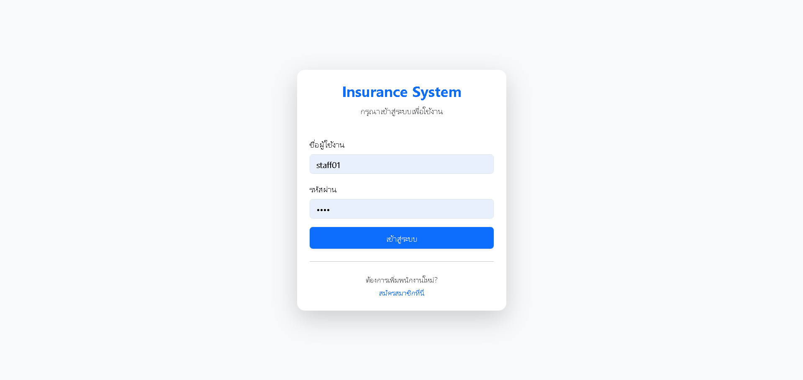
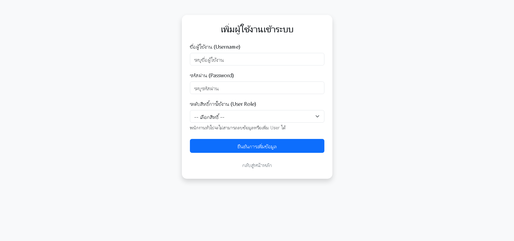
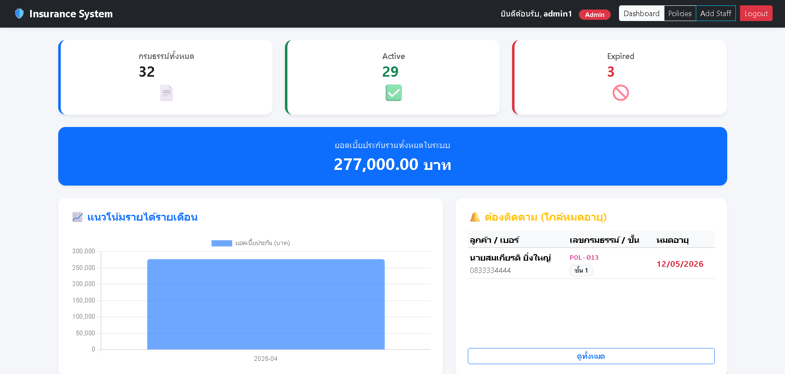
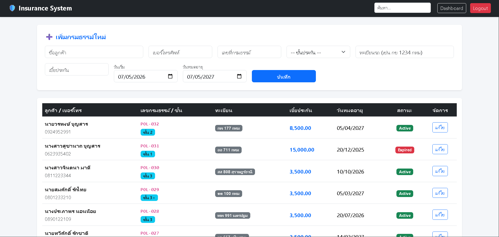
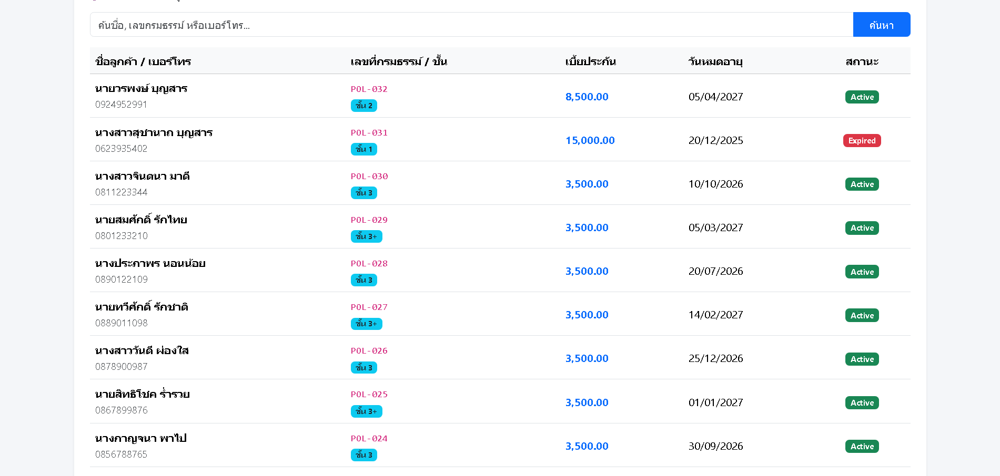

# 🛡️ Insurance Management System

Web-based insurance management system developed using PHP and MySQL. Designed with a clean, responsive interface for efficient record handling and financial monitoring.

---

## 📸 System Overview & Features

### 🔑 Secure Authentication
Implement a robust login system with role-based access control (Admin/Staff) and password security.
| Login Interface | Staff Registration |
| :---: | :---: |
|  |  |
| Modern login form for authorized access. | Admin-controlled staff registration. |

### 📊 Administrative Dashboard
Comprehensive analytics providing real-time metrics on policy status and financial trends.

- **Key Metrics:** Real-time tracking of Total, Active, and Expired policies.
- **Financial Insights:** Monthly revenue trend visualization using interactive charts.
- **Follow-up System:** Automated alerts for policies nearing expiration.

### 📋 Policy Management & Operations
A streamlined workflow for managing policyholder records and vehicle information.
| Dynamic Form Entry | Advanced Data Table |
| :---: | :---: |
|  |  |
- **CRUD Operations:** Easily create, read, update, and delete insurance records.
- **Smart Filtering:** Instant search by name, policy number, or license plate for quick retrieval.
- **Status Indicators:** Clear visual cues for 'Active' and 'Expired' statuses.

---

## 🛠️ Technologies Used
- **Backend:** PHP (Core Logic)
- **Database:** MySQL (Data Integrity & Storage)
- **Frontend:** HTML5, CSS3, JavaScript, **Bootstrap 5** (Responsive Layout)
- **Environment:** XAMPP (Local Server)

---

## ⚙️ How to Run
1. **Install XAMPP:** Ensure you have Apache and MySQL services running.
2. **Clone Project:** Place the insurance-app folder inside your htdocs directory.
3. **Database Setup:** - Open phpMyAdmin.
   - Create a new database named `insurance_db`.
   - Import the provided .sql file.
4. **Access:** Open your browser and go to `http://localhost/insurance-app`.
